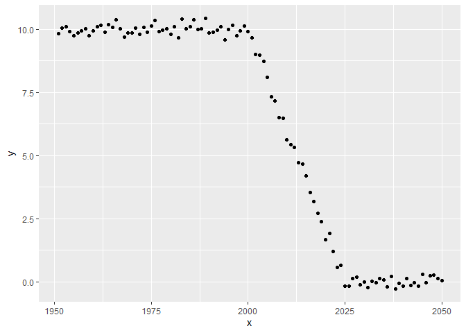
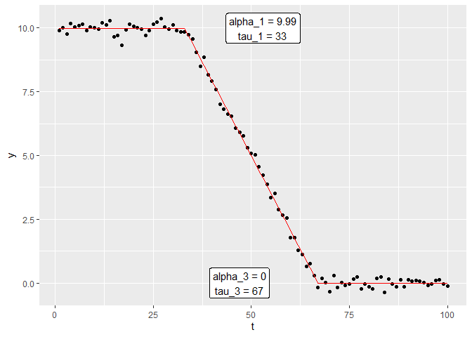

<!-- README.md is generated from README.Rmd. Please edit that file -->

# DTtiming

<!-- badges: start -->
<!-- badges: end -->

The goal of DTtiming is to estimate the timing of the demographic
transition using the model by Delventhal, Fernandez-Villaverde, and
Guner (2023)

## Installation

You can install the development version of DTtiming like so:

``` r
remotes::install_github("https://github.com/m-g-h/DTtiming")
```

## Example

Setup and example data:

``` r
library(DTtiming)
library(ggplot2)

## Create example data:
T_max = 100
t = 1950+(1:T_max)
tau_2 = 2000
tau_3 = 2025
y = matrix(make_z1_scalar(t, tau_2, tau_3)*10 + rnorm(T_max, sd = 0.2),
          ncol = 1)

# Plot the data:
ggplot(data.frame(x = t,
                  y = y),
  aes(x = x, y = y)) +
  geom_point()
```



Now we can fit the model:

``` r

DT_fit = grid_Search_best_DT_fit(y)

plot_DT_fit(DT_fit)
```



All relevant parameters are returned:

``` r
DT_fit
#> $alpha
#>       alpha_1       alpha_3 
#>  9.9911061047 -0.0002470735 
#> 
#> $sigma_sq
#> sigma_sq_1 sigma_sq_3 
#> 0.03392059 0.02716421 
#> 
#> $tau
#> tau_2 tau_3 
#>    50    75 
#> 
#> $y
#>   [1]  9.81559941 10.04116663 10.09262839  9.92158327  9.74988627  9.85635686
#>   [7]  9.94676542 10.01008928  9.75391763  9.92302483 10.09624282 10.16788880
#>  [13]  9.89509541 10.18079171 10.06412345 10.36969151 10.02197098  9.70114019
#>  [19]  9.84877976  9.84816401 10.03601738  9.80682423 10.07746869  9.88382435
#>  [25] 10.14002805 10.34583038  9.91531077  9.97062246 10.03000708  9.80369614
#>  [31] 10.10378120  9.65479454 10.40603044 10.02928931 10.08856186 10.37533121
#>  [37]  9.99517284 10.01568301 10.42354985  9.84162851  9.88099758  9.97548229
#>  [43] 10.10082831  9.57883813  9.98621688 10.15938566  9.73415888  9.93938333
#>  [49] 10.12711402  9.91138105  9.66823175  9.00166787  8.96119905  8.73662052
#>  [55]  8.10131307  7.31726470  7.17321175  6.50654816  6.48175681  5.63153779
#>  [61]  5.43486151  5.33426453  4.72422165  4.65860236  4.19751433  3.54346724
#>  [67]  3.17569933  2.71492670  2.37421413  1.68033502  1.92559125  1.19693078
#>  [73]  0.57822333  0.66239580 -0.17668770 -0.17728216  0.14101733  0.18256314
#>  [79] -0.11458882 -0.01622389 -0.22517991  0.01733328 -0.04172466  0.12250288
#>  [85]  0.07643121 -0.20221199  0.21438682 -0.26986148 -0.06414734 -0.16877885
#>  [91]  0.12646352 -0.13706212 -0.04556253 -0.17163336  0.29402406 -0.03181302
#>  [97]  0.24170050  0.25963055  0.13766851  0.04548125
#> 
#> $y_hat
#>   [1]  9.9911061047  9.9911061047  9.9911061047  9.9911061047  9.9911061047
#>   [6]  9.9911061047  9.9911061047  9.9911061047  9.9911061047  9.9911061047
#>  [11]  9.9911061047  9.9911061047  9.9911061047  9.9911061047  9.9911061047
#>  [16]  9.9911061047  9.9911061047  9.9911061047  9.9911061047  9.9911061047
#>  [21]  9.9911061047  9.9911061047  9.9911061047  9.9911061047  9.9911061047
#>  [26]  9.9911061047  9.9911061047  9.9911061047  9.9911061047  9.9911061047
#>  [31]  9.9911061047  9.9911061047  9.9911061047  9.9911061047  9.9911061047
#>  [36]  9.9911061047  9.9911061047  9.9911061047  9.9911061047  9.9911061047
#>  [41]  9.9911061047  9.9911061047  9.9911061047  9.9911061047  9.9911061047
#>  [46]  9.9911061047  9.9911061047  9.9911061047  9.9911061047  9.9911061047
#>  [51]  9.5914519776  9.1917978504  8.7921437233  8.3924895962  7.9928354690
#>  [56]  7.5931813419  7.1935272148  6.7938730877  6.3942189605  5.9945648334
#>  [61]  5.5949107063  5.1952565792  4.7956024520  4.3959483249  3.9962941978
#>  [66]  3.5966400706  3.1969859435  2.7973318164  2.3976776893  1.9980235621
#>  [71]  1.5983694350  1.1987153079  0.7990611808  0.3994070536 -0.0002470735
#>  [76] -0.0002470735 -0.0002470735 -0.0002470735 -0.0002470735 -0.0002470735
#>  [81] -0.0002470735 -0.0002470735 -0.0002470735 -0.0002470735 -0.0002470735
#>  [86] -0.0002470735 -0.0002470735 -0.0002470735 -0.0002470735 -0.0002470735
#>  [91] -0.0002470735 -0.0002470735 -0.0002470735 -0.0002470735 -0.0002470735
#>  [96] -0.0002470735 -0.0002470735 -0.0002470735 -0.0002470735 -0.0002470735
#> 
#> $RSS
#> [1] 3.469634
```

## References

<div id="refs" class="references csl-bib-body hanging-indent">

<div id="ref-delventhalDemographicTransitionsTime2023"
class="csl-entry">

Delventhal, Matthew J, Jesus Fernandez-Villaverde, and Nezih Guner.
2023. “Demographic Transitions Across Time and Space.” Working {{Paper}}
2022-031. Chicago: HCEO Human Capital and Economic Opportunity Global
Working Group.

</div>

</div>
