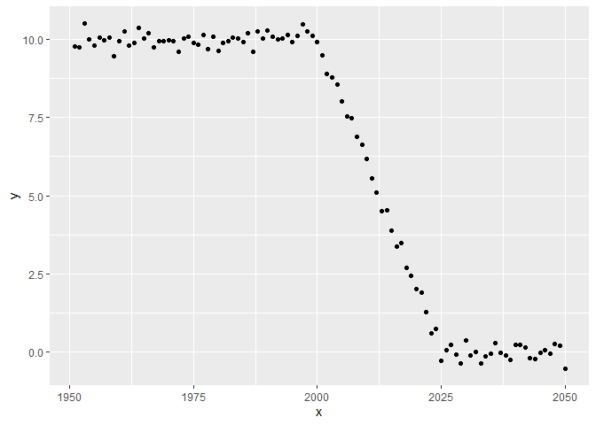
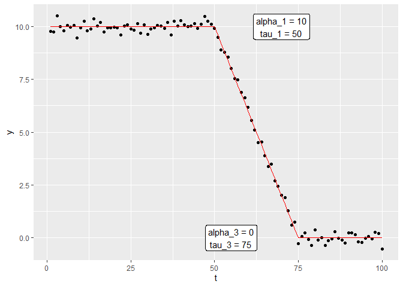

<!-- README.md is generated from README.Rmd. Please edit that file -->

# DTtiming

<!-- badges: start -->
<!-- badges: end -->

The goal of DTtiming is to estimate the timing of the demographic
transition using the model by Delventhal, Fernandez-Villaverde, and
Guner (2023)

## Installation

You can install the development version of DTtiming like so:

``` r
remotes::install_github("https://github.com/m-g-h/DTtiming")
```

## Example

Setup example data:

``` r
library(DTtiming)
library(ggplot2)

## Create example data:
T_max = 100
t = 1950+(1:T_max)
tau_2 = 2000
tau_3 = 2025
y = matrix(make_z1_scalar(t, tau_2, tau_3)*10 + rnorm(T_max, sd = 0.2),
          ncol = 1)

# Plot the data:
ggplot(data.frame(x = t,
                  y = y),
  aes(x = x, y = y)) +
  geom_point()
```



Now we can fit the model:

``` r

DT_fit = grid_Search_best_DT_fit(y)

plot_DT_fit(DT_fit)
```



All relevant parameters are returned:

``` r
DT_fit
#> $alpha
#>      alpha_1      alpha_3 
#>  9.995653271 -0.004006004 
#> 
#> $sigma_sq
#> sigma_sq_1 sigma_sq_3 
#> 0.03993147 0.04411771 
#> 
#> $tau
#> tau_2 tau_3 
#>    50    75 
#> 
#> $y
#>   [1]  9.778335878  9.746206272 10.502007190 10.009691704  9.806878834
#>   [6] 10.052783039  9.962129142 10.048436901  9.451010166  9.939745051
#>  [11] 10.261685758  9.804002748  9.875303533 10.381729420 10.034761826
#>  [16] 10.187610486  9.757610336  9.953055668  9.957150813  9.977056609
#>  [21]  9.955638086  9.611269617 10.040870006 10.073008441  9.887960918
#>  [26]  9.836340783 10.152124320  9.682753062 10.090093782  9.645082948
#>  [31]  9.877686401  9.950349820 10.057980428 10.028116758  9.923932361
#>  [36] 10.184358161  9.593299362 10.248139680 10.038237185 10.272491366
#>  [41] 10.095585310 10.003994938 10.020377432 10.134691405  9.926175822
#>  [46] 10.099570996 10.471493981 10.242249915 10.106899664  9.927156112
#>  [51]  9.488703297  8.894230697  8.784071962  8.562633310  8.021322943
#>  [56]  7.547481786  7.467006463  6.881295521  6.636532362  6.171618920
#>  [61]  5.566847473  5.098184384  4.514286251  4.544126875  3.871268596
#>  [66]  3.369698407  3.492537413  2.680955318  2.451824957  2.018175277
#>  [71]  1.911467418  1.267722881  0.606147351  0.754163306 -0.275136096
#>  [76]  0.063529423  0.224959948 -0.070460794 -0.360395942  0.376174598
#>  [81] -0.118426738 -0.003743479 -0.360079259 -0.135952699 -0.057007220
#>  [86]  0.294625021 -0.033572858 -0.121094362 -0.254093893  0.241040102
#>  [91]  0.231601627  0.151532580 -0.185003515 -0.212212303 -0.012761739
#>  [96]  0.071908999 -0.065604139  0.251360559  0.188830995 -0.519167724
#> 
#> $y_hat
#>   [1]  9.995653271  9.995653271  9.995653271  9.995653271  9.995653271
#>   [6]  9.995653271  9.995653271  9.995653271  9.995653271  9.995653271
#>  [11]  9.995653271  9.995653271  9.995653271  9.995653271  9.995653271
#>  [16]  9.995653271  9.995653271  9.995653271  9.995653271  9.995653271
#>  [21]  9.995653271  9.995653271  9.995653271  9.995653271  9.995653271
#>  [26]  9.995653271  9.995653271  9.995653271  9.995653271  9.995653271
#>  [31]  9.995653271  9.995653271  9.995653271  9.995653271  9.995653271
#>  [36]  9.995653271  9.995653271  9.995653271  9.995653271  9.995653271
#>  [41]  9.995653271  9.995653271  9.995653271  9.995653271  9.995653271
#>  [46]  9.995653271  9.995653271  9.995653271  9.995653271  9.995653271
#>  [51]  9.595666900  9.195680529  8.795694158  8.395707787  7.995721416
#>  [56]  7.595735045  7.195748674  6.795762303  6.395775932  5.995789561
#>  [61]  5.595803190  5.195816819  4.795830448  4.395844077  3.995857706
#>  [66]  3.595871335  3.195884964  2.795898593  2.395912222  1.995925851
#>  [71]  1.595939480  1.195953109  0.795966738  0.395980367 -0.004006004
#>  [76] -0.004006004 -0.004006004 -0.004006004 -0.004006004 -0.004006004
#>  [81] -0.004006004 -0.004006004 -0.004006004 -0.004006004 -0.004006004
#>  [86] -0.004006004 -0.004006004 -0.004006004 -0.004006004 -0.004006004
#>  [91] -0.004006004 -0.004006004 -0.004006004 -0.004006004 -0.004006004
#>  [96] -0.004006004 -0.004006004 -0.004006004 -0.004006004 -0.004006004
#> 
#> $RSS
#> [1] 4.423988
```

## References

<div id="refs" class="references csl-bib-body hanging-indent">

<div id="ref-delventhalDemographicTransitionsTime2023"
class="csl-entry">

Delventhal, Matthew J, Jesus Fernandez-Villaverde, and Nezih Guner.
2023. “Demographic Transitions Across Time and Space.” Working {{Paper}}
2022-031. Chicago: HCEO Human Capital and Economic Opportunity Global
Working Group.

</div>

</div>
